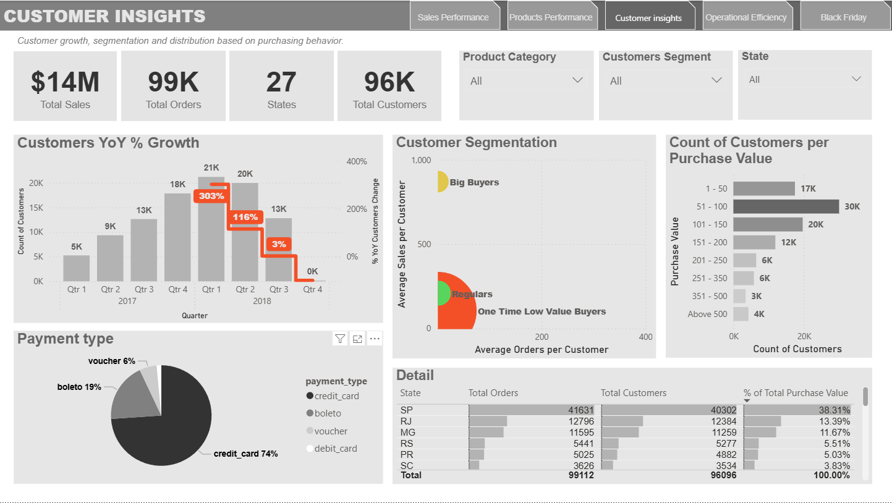
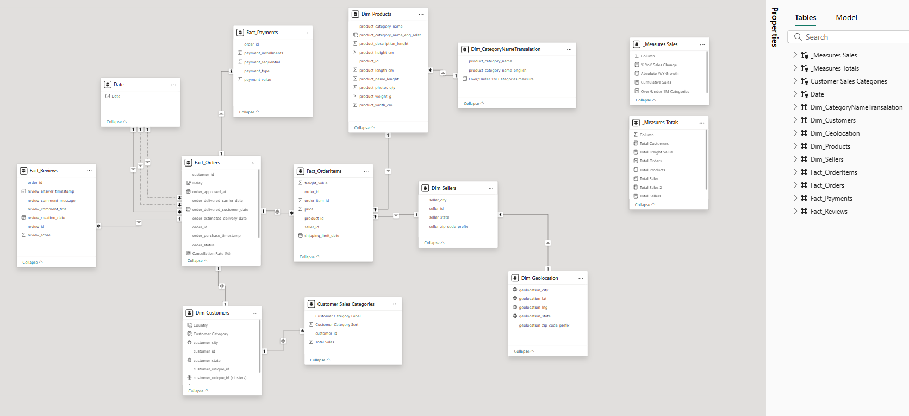

# real-ecommerce-analytics

This project demonstrates powerful **data exploration and visualization** using the **OLIST** dataset — a rich Brazilian e-commerce dataset capturing real customer orders, product details, payments, and seller information.

---

## About OLIST Dataset
The OLIST dataset is **one of the largest and most detailed e-commerce datasets available on Kaggle**, capturing a rich panorama of Brazil’s online retail market with transactional data.

- Customer demographics and behavior  
- Order and payment information  
- Product categories and seller profiles  
- Delivery and logistics data  

This depth and variety make OLIST a perfect playground for **business intelligence**, data analytics, and machine learning projects focused on retail and e-commerce.

---

## Business Schema: The Snowflake Model

The dataset follows a **large snowflake schema**, a sophisticated multi-dimensional model widely used in data warehousing and BI systems. Key highlights include:

- **Normalized dimension tables** for customers, products, sellers, and payments  
- A central **fact table of orders** connecting these dimensions  
- Improved data integrity and reduced redundancy  
- Enables complex slicing and dicing for in-depth analysis  

This schema helps deliver fast, flexible, and accurate insights essential for data-driven decision-making.

---

## Power BI Views

The project showcases multiple interactive Power BI dashboards designed to unlock actionable insights from OLIST data:

### Customer Insights View  
   
Most customers are based in São Paulo (SP) state, which is the largest economic hub of Brazil and a key driver of e-commerce activity. The OLIST e-commerce dataset can be segmented into three main buyer groups: the mass market base, which consists of a broad population buying affordable products regularly; premium buyers, who purchase expensive items but less frequently; and regular buyers, who make frequent purchases over time. Most orders fall within the $51-$100 range, indicating a strong middle-market demand. Notably, the city of São Paulo alone accounts for 14% of total sales, underscoring its dominant role in Brazil’s e-commerce landscape.

### Operational Efficiency View  
  
Amazonas (AM) and Ceará (CE) are Brazilian states known for frequent shipping delays primarily due to challenging geography and infrastructure limitations. Amazonas, covered by dense rainforest with many remote areas accessible only by river or air, faces complex and slow logistics. Ceará, located in the Northeast and farther from major economic hubs, also deals with infrastructure bottlenecks that slow down deliveries. Both states experience higher freight costs, which can deprioritize shipments, and seasonal weather conditions such as heavy rains and flooding further disrupt transport. These combined factors make shipping to AM and CE slower and less reliable compared to other regions in Brazil.

### Sales Performance View  
  
In 2017-2018, watches, gifts, and health & beauty soared in Brazilian e-commerce as online shopping grew fast, fueled by social media trends and easier access to products. Watches and gifts are often listed together because both are popular gift choices online. São Paulo led as the biggest buyer thanks to its huge population, strong economy, and advanced infrastructure making online shopping smoother and faster.

---

## Why This Project Is Valuable

- **Hands-on experience with a complex, real-world dataset** simulating e-commerce business operations  
  

  

